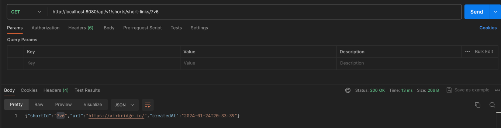
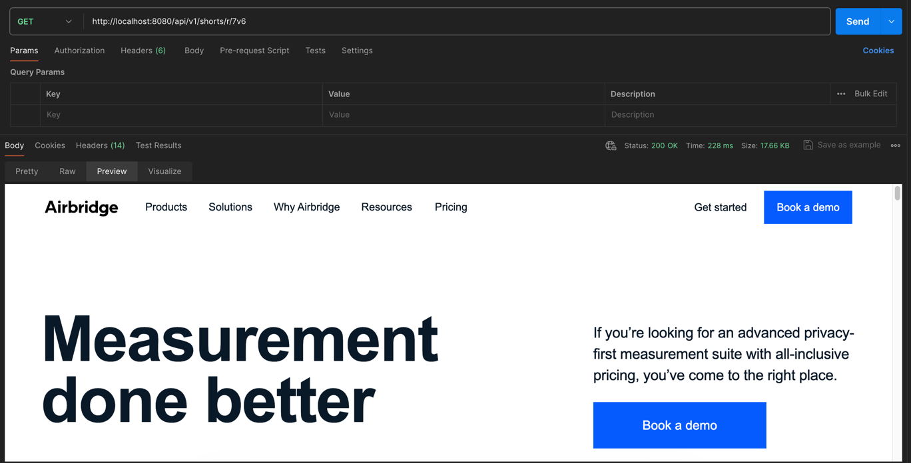
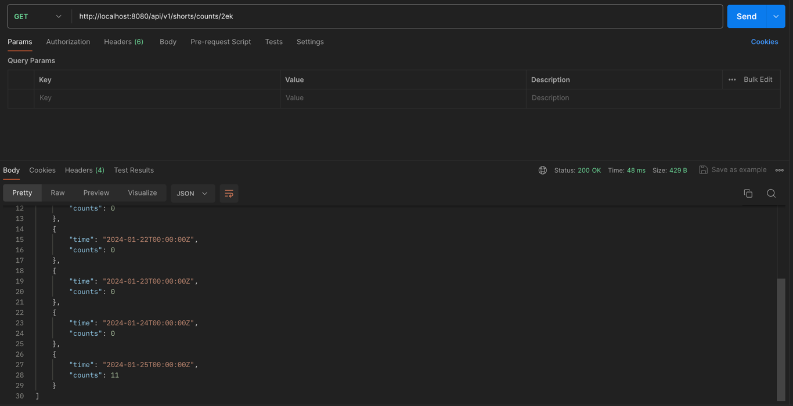
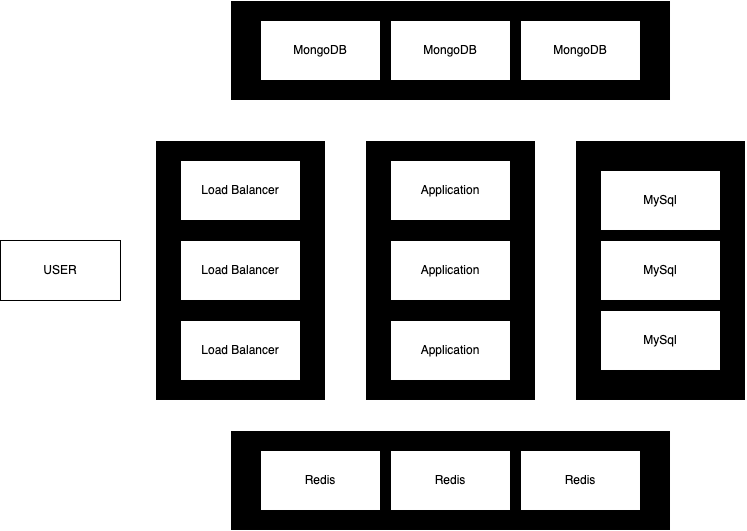

## Project info
- python version: 3.12
- framework: fastapi
- database: mysql, mongodb, redis

## Features
- Short Link 생성 API

- Short Link 조회 API

- Short Link Origin url redirect API

- Short Link 7일 조회 API

- 테스트 코드

- [locust 테스트 결과](app%2Flocust_test_report.html)


## System Design
Data / Resource
- origin url : 2048 chars = 2KB
- short id : 3chars up = 3B ~
- created_at : datetime = 20B
- 한 로우당 2kb 정도 소비
- 하루 10억번의 클릭에 대한 통계 저장 및 10억개 이상의 로우 생성 = 4,000GB 이상
- 1년 약 1500TB 저장

DataBase
- short id(unique) : mysql
    - 데이터의 일관성과 안전성
    - 서비스 기능 확장 고려
- 대용량 데이터(click count): mongodb
    - scale out 및 대용량 데이터 처리
    - key-value 형태 조회 성능
- cache : redis
    - 인메모리에 저장되므로 빠른 응답
    - ttl 설정으로 데이터 유지 기간 관리

Hash
- origin url + uuid4를 md5로 변환
    - origin url만으로 인코딩하는 경우 충돌 가능성 높아짐
    - uuid4 : 36개의 16진수 문자
- 변환된 16진수를 base62로 변환
    - 3글자 이상의 alphanumeric 문자열 조건

Server Architecture



## Hot to Run
```shell
# 가상환경 구축 및 활성 
virtualenv venv --python=python3.12
source venv/bin/activate
pip install -r requirements.txt

# database 실행
docker-compose -f ./app/db/docker-compose.yaml up -d

# 1~2분 대기
# mysql migration
alembic upgrade head

# 테스트 코드 실행
bash test.bash

# 서버 실행
uvicorn app.main:app --host localhost --port 8080
```

## API
- swagger url: http://localhost:8080/swagger#
- redoc url: http://localhost:8080/redoc
