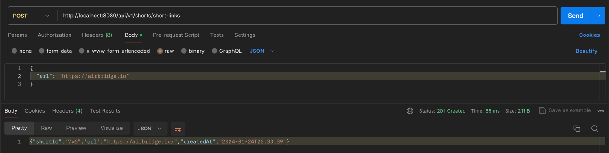
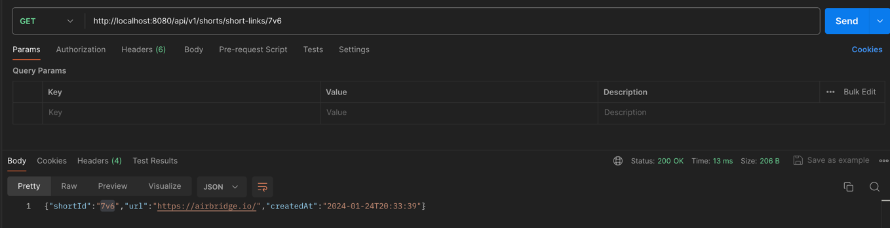
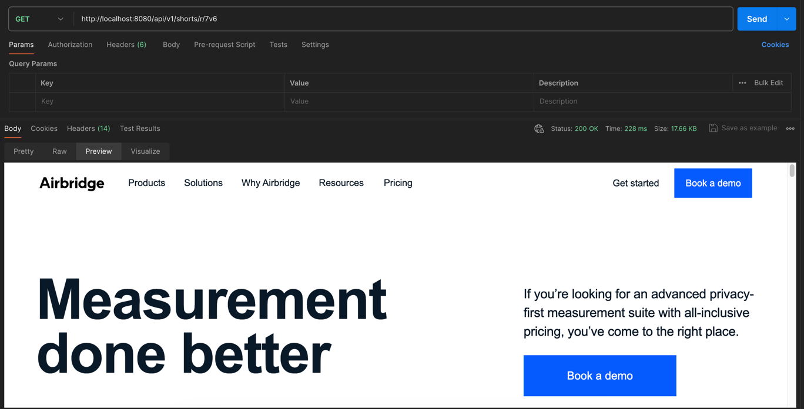
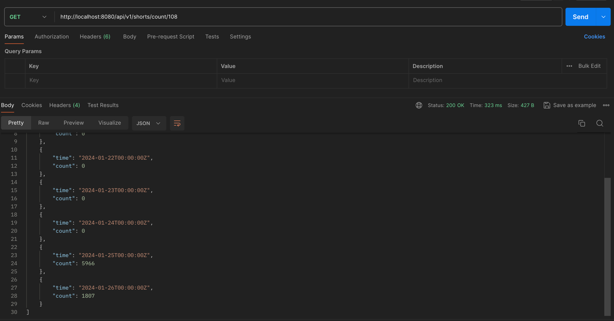
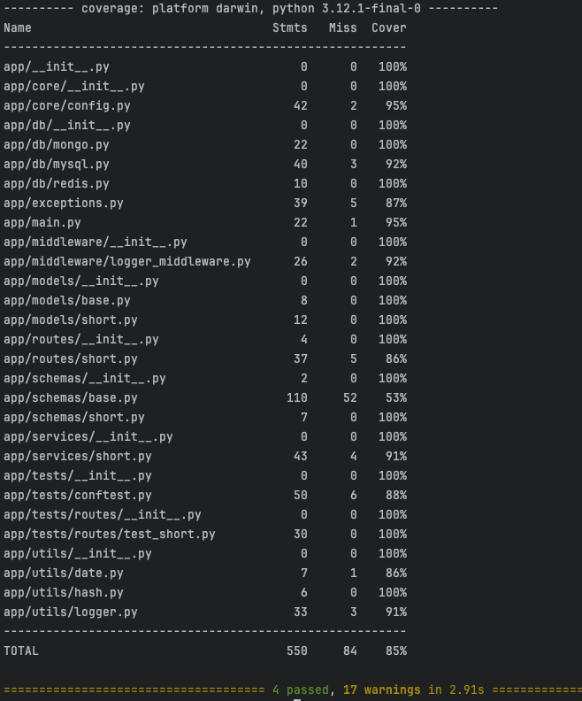

## Project info
- python version: 3.12
- framework: fastapi
- database: mysql, mongodb, redis

## Features
- Short Link Creation API

- Short Link Retrieval API

- Short Link Origin URL Redirect API

- Short Link 7-Day Retrieval API

- Test Code

- [locust Test Results](app%2Flocust_test_report.html)


## System Design
Data / Resource
- origin url: 2048 chars = 2KB
- short id: 3 chars up = 3B ~
- created_at: datetime = 20B
- Approximately 2KB consumed per row
- Saving statistics and generating over 1 billion rows per day = 4,000GB+
- Approximately 1500TB storage needed per year

Database
- short id (unique): MySQL
    - Data consistency and safety
    - Consideration for service feature expansion
- Large data (click count): MongoDB
    - Scale out and large data processing
    - Key-value query performance
- Cache: Redis
    - Stored in-memory for fast response
    - Data retention managed by TTL settings

Hash
- Convert origin url + uuid4 to md5
    - High collision risk if encoded with origin url only
    - uuid4: 36 hexadecimal characters
- Convert hashed 16 characters to base62
    - Condition of alphanumeric string with at least 3 characters

Server Architecture


## How to Run
```shell
# Set up and activate virtual environment
virtualenv venv --python=python3.12
source venv/bin/activate
pip install -r requirements.txt

# Run database
docker-compose -f ./app/db/docker-compose.yaml up -d

# Wait 1-2 minutes
# MySQL migration
alembic upgrade head

# Run test code
bash test.bash

# Run server
uvicorn app.main:app --host localhost --port 8080
```

## API
- swagger url: http://localhost:8080/swagger
- redoc url: http://localhost:8080/redoc
